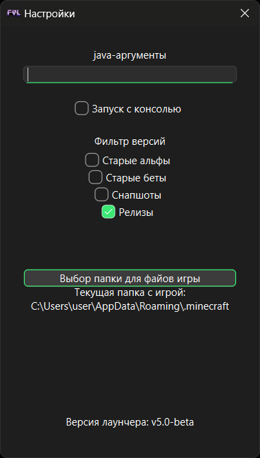
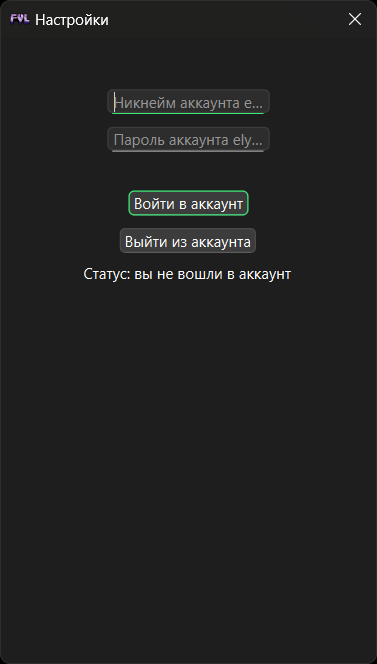

# FVLauncher

NOT AN OFFICIAL MINECRAFT PRODUCT. NOT APPROVED BY OR ASSOCIATED WITH MOJANG OR MICROSOFT  

## Для чего он нужен?

Лаунчер предназначен для запуска Minecraft.  
Требуется официальная копия Minecraft. Автор не несёт ответственности за использование пиратских версий.

## Загрузка лаунчера

1. Кликните [сюда](https://github.com/FerrumVega/FVLauncher/releases/latest/download/FVLauncher_Installer.exe) для загрузки инсталлера последней версии лаунчера
2. Скачайте [java](https://adoptium.net/)

## Частые вопросы и ответы на них

### Проблемы

1. Проблема: Краш игры при запуске на старых версиях  
Решение: Удалить options.txt
2. Проблема: Игра не запускается  
Решение: Включите "Запуск с консолью" в настройках и откройте issue на github лаунчера с приложеным FVLauncher.log

### Вопросы

1. Вопрос: Почему антивирус обнаруживает угрозу в файле?  
Ответ: Это связано с системой упаковки exe-файла. Вы можете удостовериться в этом, собрав exe самостоятельно
2. Вопрос: Почему я должен скачать именно этот лаунчер?  
Ответ: Мой лаунчер имеет открытый исходный код, весит около 700 мб и использует официальные версии с сайта разработчиков игры

## Скриншоты

## Клонирование репозитория

1. Используйте команду `git clone https://github.com/FerrumVega/FVLauncher` в консоли/терминале
2. Создайте виртуальное окружение корне проекта (`python -m venv venv`)
3. Установите зависимости (`pip install -r requirements.txt`)
4. Для сборки в exe используйте команду из build.bat, для создания инсталлера используйте installer.iss
